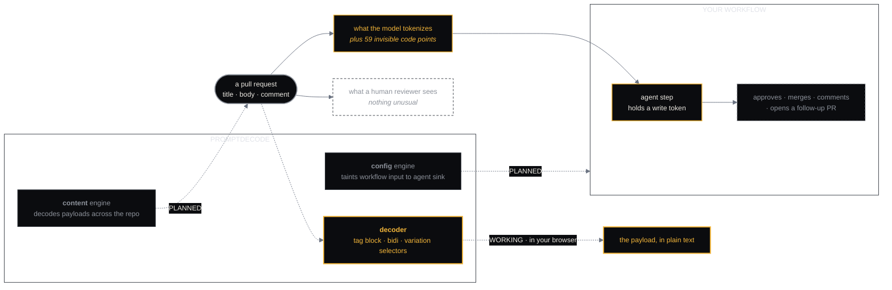

  

  
  
  

  
    <a href="https://promptdeco.de">Site</a> &nbsp;·&nbsp;
    <a href="https://promptdeco.de/#demo">Decode something</a> &nbsp;·&nbsp;
    <a href="https://promptdeco.de/llms.txt">llms.txt</a> &nbsp;·&nbsp;
    <a href="#what-this-does-not-do">What it does not do</a>
  

---

## Finds what only the agent can read.

Hidden text in a pull request can instruct your agent to approve it. We find and decode it before
the agent does.

Three classes of Unicode code point render as nothing in every editor, diff view and review UI, and
are tokenized normally by a language model. A reviewer approving a change and an agent acting on it
are not reading the same document.

---

## Two things, and which is which

This matters more than anything else on this page, so it is first.

| | What it is | Status |
| :--- | :--- | :--- |
| **The decoder** | The tool at [promptdeco.de/#demo](https://promptdeco.de/#demo). Paste any text; it reports every hidden code point and reconstructs the payload. Runs in your browser, sends nothing anywhere. | `WORKING` |
| **promptdecode** | The product: the `config` and `content` engines, the CLI, the GitHub Action, the open benchmark, the private-repo tier. | `PLANNED` |

Nothing beyond the decoder and its page is built. There is no published package, no action to
install, no benchmark, no docs site, and no price, published or estimated.

Two labels are used everywhere, and they govern the tense of the sentence around them:

- `WORKING`: built, deployed, usable now. Present tense is allowed only here.
- `PLANNED`: named, not built. Conditional tense, and a chip wherever it appears on the site.

---

## What the decoder reads

**The list is the claim.** If a class is not below, it is not detected, and nothing on the site
implies otherwise.

| Class | Range | What it does |
| :--- | :--- | :--- |
| Unicode tag block | `U+E0000` to `U+E007F` | Mirrors printable ASCII at an offset of `0xE0000`. A run of them is recoverable as plain text, and the decoder recovers it |
| Bidi controls and overrides | `U+061C`, `U+200E`, `U+200F`, `U+202A`–`U+202E`, `U+2066`–`U+2069` | Reorders what a human sees without changing what a parser or a model reads |
| Variation selectors | `U+FE00`–`U+FE0F`, `U+E0100`–`U+E01EF` | Carry data with no visible glyph of their own |

The site's check script compares these ranges against the code in
[`website`](https://github.com/PromptDecode/website) and fails in both directions, so the promise
and the implementation cannot drift apart.

---

## The attack it is about

Drawn as designed. Only the box marked `WORKING` exists today.

---

## The argument, in four points

**1. The reviewer and the agent read different documents.** Tag-block characters have no glyph.
GitHub renders them as nothing, your editor renders them as nothing, and a diff shows no change.
A tokenizer does not skip them.

**2. Decoding beats flagging.** "Suspicious Unicode detected" tells you to go and look. The payload
in plain text tells you what it said, and whether it was aimed at your agent.

**3. The workflow is half the problem.** A hidden instruction only matters if something acts on it.
The planned `config` engine is about the other half: untrusted input reaching an agent step that
holds a write token, traced statically, with no model in the loop.

**4. We will not publish a percentage of attacks blocked.** Published evasion rates against
commercial detectors swing wildly with technique, and a number that moves that much is not a number.
Two things are worth publishing instead: deterministic coverage of named Unicode classes, and recall
at a stated false-positive rate on a named corpus, with the corpus and harness in the open. Neither
the corpus nor the harness is written yet.

---

## What this does not do

Stated here rather than buried, because trust is the whole point.

- **It does not scan anything, yet.** There is no CLI, no engine, no Action. The decoder reads one
  piece of text that you give it, in your browser.
- **It does not catch what is not on the list.** Homoglyphs, zero-width joiners used for other
  purposes, steganography in images, and every technique not named above go undetected. That is a
  statement about scope, not a claim of completeness.
- **It does not see your code.** The decoder makes no network request, and the site's
  Content-Security-Policy sets `connect-src 'none'` so the browser would refuse one.
- **It is not a policy engine.** Finding a payload is not deciding what to do about it.
- **No prices.** Not published, not estimated.
- **No affiliation** with GitHub or any vendor named on the site.

---

## Roadmap, in public

| Capability | Status | Where |
| :--- | :--- | :--- |
| The decoder, the site, its `llms.txt`, social card and this profile | `WORKING` | [website](https://github.com/PromptDecode/website) |
| `promptdeco.de` on Cloudflare (the zone is still at the registrar) | `PLANNED` | [website](https://github.com/PromptDecode/website) |
| The `content` engine: the decoder's rules over a whole repository | `PLANNED` | not started |
| The `config` engine: taint analysis of GitHub Actions | `PLANNED` | not started |
| `promptdecode scan`, the CLI | `PLANNED` | not started |
| `promptdecode/action@v1`, check annotations on a PR | `PLANNED` | not started |
| The open benchmark: corpus, harness, recall at a stated FPR | `PLANNED` | not started |

The roadmap is the issue tracker. There is no private version of it.

---

## Repositories

| Repo | What it is |
| :--- | :--- |
| [**website**](https://github.com/PromptDecode/website) | promptdeco.de: the page, the decoder, its checks, its images and its deploy script. MIT |
| **.github** | This page, the banner and the mark |

   
  <a href="https://promptdeco.de"><b>promptdeco.de</b></a>
  &nbsp;·&nbsp;
  <a href="mailto:contact@promptdeco.de">contact@promptdeco.de</a>
  &nbsp;·&nbsp;
  a <a href="https://factory0.ventures">Factory Zero</a> venture

  No cookies · no analytics · nothing you paste leaves your browser

